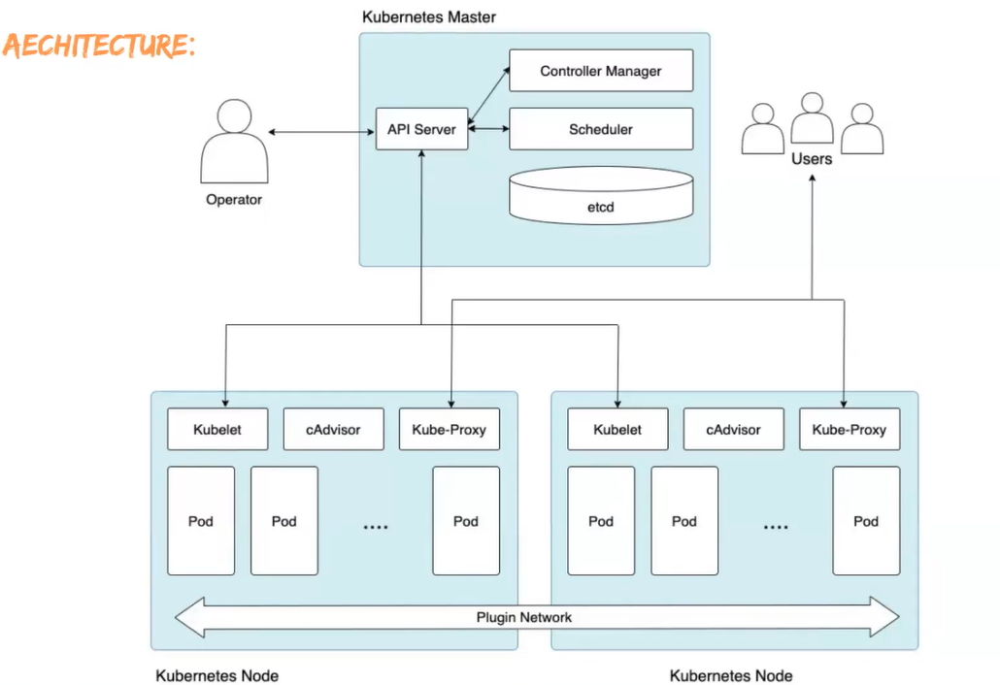
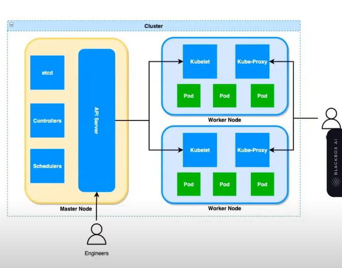

## Kubernetes:
- k8s is an open-source container orchestration platform.
- It is used to automate many of the manual processes like deploying, managing and scaling containerized applications.
- Kubernetes is developed by Google using Go Language.

## Why Kubernetes?
- Containers are good and easy way to bundle and run applications. In a production environment, we need to manage containers that run the applications and ensure that there is no downtime.
- In docker we use docker swarm for this. But docker has drawbacks.

## Features of K8S
- Orchestration (Grouping & managing containers running on different machines)
- Auto Scaling (auto creation of replicated containers)
- Auto-Healing (new containers in place of crashed containers)
- Load Balancing (Distribute requests to containers)
- Fault Tolerance (Node/Pod failures)
- Rolling updates & Rollback (Going forward/back to next/previous versions)

## K8S Architecture

- Cluster is a group of Servers(Nodes) both Master(Control Plane/Manager) & Worker Nodes.
- Master Node is used to assign tasks to Worker Nodes.
- In a Cluster(Chiranjeevi) we have Nodes(Naga Babu), In a Node we have Pods(Pawan Kalyan), In a pod we have Containers(Charan).
- K8S never communicate with containers it only know pods and it will communicate with pods. Pods will communicate with containers.

## Componenets
### Master Node:
1. API Server: DevOps Engineer communicates with API Server to create PODs,etc.
2. ETCD: Its the Database of our Cluster, all the cluster info will be here.
3. Control Manager: The Controller Manager creates object info (via various controllers like the Deployment Controller, ReplicaSet Controller, etc.) and  ensures that the current state matches the required state.
Ex: If a Deployment requests 3 replicas, but only 2 Pods are running, the Replication Controller creates a new Pod.
4. Scheduler: will assignt the objects to suitable nodes.
   
### Woker Node:
1. 

Flow:
kubectl sends the request of DevOps engineer to Kube-apiserver which is present in Master node/Control Plane/Manager node.
API-server writes the information to etcd(the key-value store that acts as kubernetes "brain")
etc now stores the desired state(3 pods running my-app).
Controller Manager Detects a Mismatch :The Controller Manager constantly watches etcd for 
any changes.
It detects that:
The desired state = 3 Pods.
The current state = 0 Pods (since none exist yet).
Since there’s a mismatch, the ReplicaSet Controller (inside the Controller Manager) creates 3 new Pod objects and sends the info to api-server and api-server will update in etcd.
Scheduler watches api-server and when there are new pods created it will try to gain info of clusters from etcd through api-server and assigns the sutiable node (based on resources) and updates etcd through api-server.
Kubelet in worker nodes watches api-server and gets info of pod that node has to run and gives instrucitons to container runner(container engine).
container engine will start containers and only interacts with kubelet.
kubelet will send the status back to api-server which writed in etcd.

